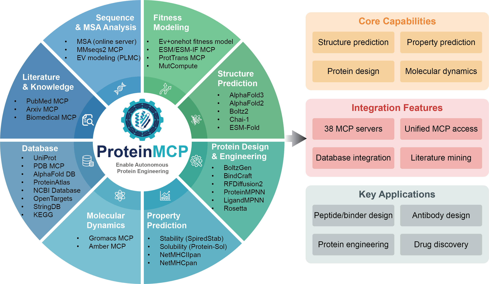

# ProteinMCP: An Agentic AI Framework for Autonomous Protein Engineering

[](https://charlesxu90.github.io/ProteinMCP/)
[](./LICENSE)

**[Documentation](https://charlesxu90.github.io/ProteinMCP/)** | **[Installation](https://charlesxu90.github.io/ProteinMCP/installation)** | **[Quick Start](https://charlesxu90.github.io/ProteinMCP/quickstart)** | **[MCP Catalog](https://charlesxu90.github.io/ProteinMCP/mcps/)** | **[Workflows](https://charlesxu90.github.io/ProteinMCP/workflows/)**



This is part of the [MacromNex](https://github.com/MacromNex) ecosystem.

> [!NOTE]
> This repository is a fork of the original [ProteinMCP](https://github.com/charlesxu90/ProteinMCP) framework, updated to support Google Gemini and OpenAI models via the Goose CLI agent. You can read the original study published in *Protein Science* here: [ProteinMCP: An agentic AI framework for autonomous protein engineering](https://onlinelibrary.wiley.com/doi/full/10.1002/pro.70547).


## Prerequisites

The following tools must be installed on your system:

| Tool | Purpose | Install Guide |
|------|---------|---------------|
| **Python 3.10+** | Core runtime | [python.org](https://www.python.org/downloads/) |
| **Conda/Mamba** | Environment management | [miniforge](https://github.com/conda-forge/miniforge) |
| **Node.js / npm** | Claude Code CLI (optional) | [nodejs.org](https://nodejs.org/) |
| **Goose CLI** | Multi-model CLI agent (optional) | [Goose Installation](https://block.github.io/goose/docs/installation/) |
| **Docker** (with GPU support) | Containerized MCP servers | [docs.docker.com](https://docs.docker.com/get-docker/) |
| **NVIDIA drivers + nvidia-container-toolkit** | GPU access in Docker | [NVIDIA Container Toolkit](https://docs.nvidia.com/datacenter/cloud-native/container-toolkit/install-guide.html) |

Verify your setup:
```bash
python --version       # >= 3.10
conda --version        # or mamba --version
npm --version
docker --version
nvidia-smi             # GPU available
docker run --rm --gpus all nvidia/cuda:12.1.0-base-ubuntu22.04 nvidia-smi  # GPU in Docker
```

## Installation

### Step 1 — Create the Python environment

```bash
mamba env create -f environment.yml
mamba activate protein-mcp
pip install -r requirements.txt
pip install -e .
```

### Step 2 — Install Your Preferred CLI Agent

Depending on whether you want to use Anthropic's Claude Code CLI or other models like Google Gemini or OpenAI (via Goose), install the appropriate tool:

#### Option 2A: Claude Code CLI (Claude models only)
```bash
npm install -g @anthropic-ai/claude-code
```

#### Option 2B: Install Goose CLI (Gemini, OpenAI, etc.)
```bash
# Install Goose CLI
pipx install goose-ai
# Or install via npm/Homebrew according to Goose docs
```

### Step 3 — Configure LLM API Keys (For Goose/Gemini/OpenAI)

If you are using Option 2B (Goose CLI), run the interactive configuration command to set up your preferred provider and API credentials:
```bash
pmcp configure
```
Follow the prompts to select your provider (`google` or `openai`), input your API key (which will be validated in real-time), and select your default model (e.g. `gemini-1.5-flash` or `gpt-4o-mini`).

### Step 4 — Verify the installation

```bash
pmcp avail     # List all available MCPs
pskill avail   # List all available workflow skills
claude --version
```

## Supported MCPs

Please find the 38 supported MCPs in [the MCP list](./tool-mcps/README.md).

MCPs come in two runtime types:

| Type | MCPs | Install method |
|------|------|----------------|
| **Python** (local venv) | msa_mcp, alphafold2_mcp, msa_mcp, mmseqs2_mcp, ... | `quick_setup.sh` creates a local `env/` venv |
| **Docker** (GPU container) | esm_mcp, prottrans_mcp, plmc_mcp, ev_onehot_mcp, bindcraft_mcp, boltzgen_mcp | Docker image build or pull |

### Installing MCPs

**Recommended: local Docker build** (faster than pulling from registry):

```bash
# For Docker MCPs — build locally (recommended, avoids slow image pulls)
cd tool-mcps/esm_mcp && docker build -t esm_mcp:latest . && cd ../..
cd tool-mcps/prottrans_mcp && docker build -t prottrans_mcp:latest . && cd ../..
cd tool-mcps/plmc_mcp && docker build -t plmc_mcp:latest . && cd ../..
cd tool-mcps/ev_onehot_mcp && docker build -t ev_onehot_mcp:latest . && cd ../..
cd tool-mcps/bindcraft_mcp && docker build -t bindcraft_mcp:latest . && cd ../..
cd tool-mcps/boltzgen_mcp && docker build -t boltzgen_mcp:latest . && cd ../..
```

Then register with your active CLI (dynamic resolution defaults to your configured provider, or specify explicitly):
```bash
# pmcp install detects the local image and skips pulling from registry
# Registers with your configured CLI (Goose or Claude)
pmcp install esm_mcp
pmcp install prottrans_mcp

# Or specify CLI explicitly:
pmcp install esm_mcp --cli goose
pmcp install esm_mcp --cli claude
```

**Alternative: auto-install** (pulls from registry if no local image):
```bash
pmcp install esm_mcp        # Pulls ghcr.io/macromnex/esm_mcp:latest
```

**For Python MCPs** (no Docker needed):
```bash
pmcp install msa_mcp         # Runs quick_setup.sh, creates local venv
```

### Verify installed MCPs
```bash
pmcp status                  # Shows installed/registered status
# For Claude Code:
claude mcp list              # Health-check all registered MCPs
# For Goose:
goose info                   # Show active extensions
```

## Quick Start

### Option A — Workflow Skills (recommended)

Skills are guided workflows that orchestrate multiple MCP servers via Claude Code or Goose CLI.

#### For Claude Code CLI (Claude models only):
```bash
# Install a workflow (auto-installs all required MCPs)
pskill install fitness_modeling --cli claude

# Launch Claude Code and run the skill
claude
> /fitness-model
```

#### For Goose CLI (Gemini, OpenAI, etc.):
```bash
# Install a workflow (auto-registers MCPs in Goose config.yaml)
pskill install fitness_modeling --cli goose

# Run the skill interactively (pre-loads instructions in a new Goose session)
pskill run fitness_modeling
```

Goose/Claude will prompt you for inputs (protein name, data location, etc.) and execute the full pipeline.

**Available skills:**

| Skill | Required MCPs | Description |
|-------|---------------|-------------|
| `fitness_modeling` | msa_mcp, plmc_mcp, ev_onehot_mcp, esm_mcp, prottrans_mcp | Protein fitness prediction |
| `binder_design` | bindcraft_mcp | De novo binder design (RFdiffusion + ProteinMPNN + AF2) |
| `nanobody_design` | boltzgen_mcp | Nanobody CDR loop design with BoltzGen |

### Option B — Jupyter Notebooks

Standalone notebooks for step-by-step exploration. Each notebook installs dependencies, registers MCPs, and walks through the full workflow.

| Notebook | Workflow | Description |
|----------|----------|-------------|
| [fitness_modeling.ipynb](./notebooks/fitness_modeling.ipynb) | Fitness Prediction | MSA, PLMC, EV+OneHot, ESM, ProtTrans, and visualization |
| [binder_design.ipynb](./notebooks/binder_design.ipynb) | Binder Design | De novo binder design with BindCraft |
| [nanobody_design.ipynb](./notebooks/nanobody_design.ipynb) | Nanobody Design | Nanobody CDR loop design with BoltzGen |

## Usage

### MCP management
```bash
pmcp avail                # List all available MCPs
pmcp info msa_mcp         # Show MCP details
pmcp install msa_mcp      # Install an MCP
pmcp uninstall msa_mcp    # Uninstall an MCP
pmcp status               # Show installed/registered status
```

### MCP creation
```bash
# Create from GitHub repository
pmcp create --github-url https://github.com/jwohlwend/boltz \
  --mcp-dir tool-mcps/boltz_mcp \
  --use-case-filter 'structure prediction with boltz2, affinity prediction with boltz2'

# Create from local directory
pmcp create --local-repo-path tool-mcps/protein_sol_mcp/scripts/protein-sol/ \
  --mcp-dir tool-mcps/protein_sol_mcp
```

### Workflow Skill management
```bash
pskill avail              # List available workflow skills
pskill info binder_design # Show workflow details
pskill install binder_design   # Install skill + all required MCPs
pskill uninstall binder_design # Remove skill
```

## Licenses
This software is open-sourced under [](./LICENSE)

## Citation
If you're using ProteinMCP in your research or applications, please cite using this BibTeX:
```bibtex
@article{xu2026proteinmcp,
  title={ProteinMCP: An agentic AI framework for autonomous protein engineering},
  author={Xu, Xiaopeng and Feng, Chenjie and Zha, Chao and He, Wenjia and He, Maolin and Xiao, Bin and Gao, Xin},
  journal={Protein Science},
  volume={35},
  number={4},
  pages={e70547},
  year={2026},
  publisher={Wiley Online Library}
}

